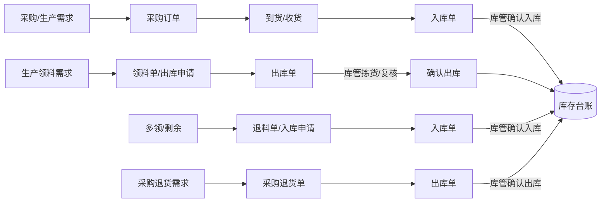
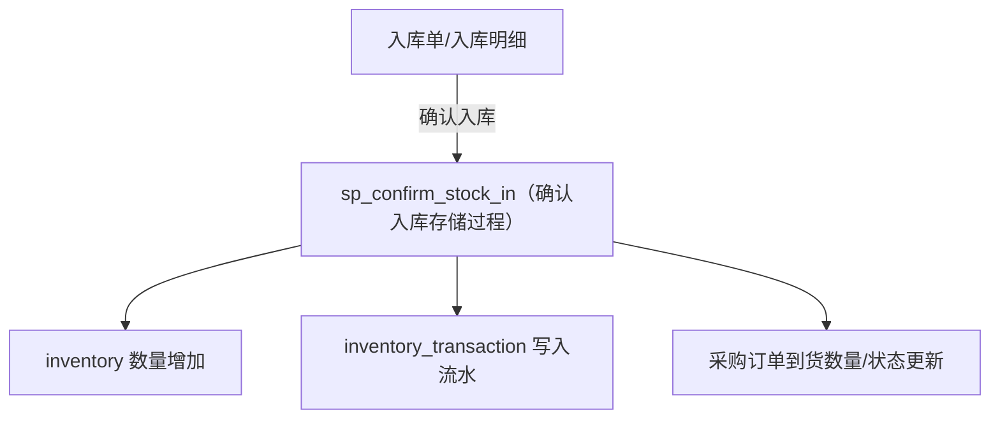
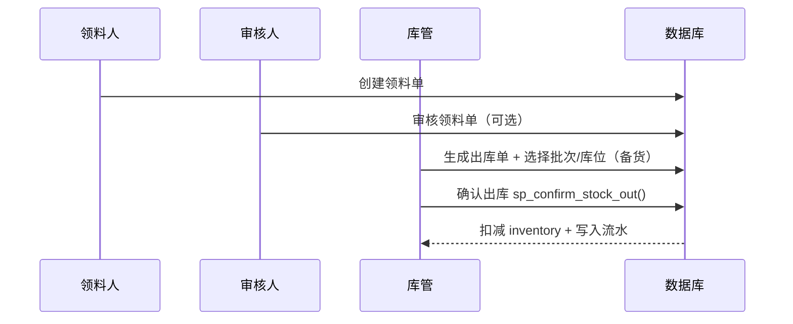
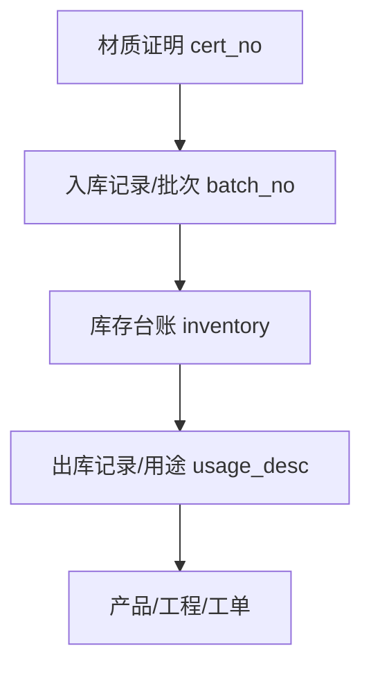
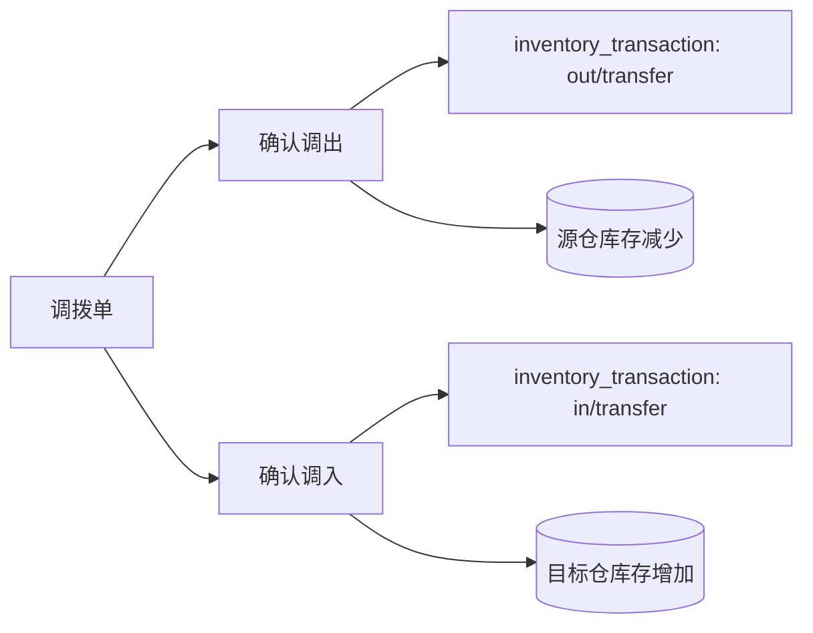

# 特维存（TeWeiCun）业务流程讲解

> 面向客户/业务人员的流程说明文档  
> 覆盖：采购 → 入库 → 领料 → 退料 → 采购退；单据如何生成出/入库单；备货与库管审核；编码生成与追溯；库存台账与大屏展示；后续扩展能力。  
> 说明：系统权限与审核人由 RBAC 配置决定，文中给出推荐岗位分工。

---

## 1. 角色与分工（推荐）

- **需求/下单人（生产/采购/计划）**
  - 提采购申请/采购订单
  - 提领料申请（领料单）
  - 提退料申请（退料单）
- **审核人（部门负责人/采购主管/生产主管）**
  - 审核采购申请/采购订单
  - 审核领料/退料申请（可选，按企业管理习惯配置）
- **库管（仓库管理员）**
  - 接收入库、组织上架
  - 出库拣货、复核、确认出库
  - 处理退料入库、采购退货出库
- **质检/质量员（特种材料强相关）**
  - 受压元件材料：确认材质证明、关键字段合规

> 重点原则：**“业务审批”与“库存变更确认”分离**  
> - 审批：谁能下单、谁能审核，是“管理制度”  
> - 确认：入库/出库确认是“库存账务动作”，由库管执行更稳妥

---

## 2. 一句话理解系统

系统里所有库存的增减，都最终落到两张表：

- **库存台账**：`inventory`（每个“物料 + 仓库 + 批次(+库位)”一行实时库存）
- **库存流水**：`inventory_transaction`（每次入/出/调整/锁定/解锁一条记录）

入库/出库/退料/采购退货等动作，都会生成对应单据，并在“确认”时通过数据库存储过程完成**原子事务**：

- 入库确认：`sp_confirm_stock_in()`
- 出库确认：`sp_confirm_stock_out()`

---

## 3. 端到端流程总览

---

## 4. 采购 → 入库：怎么生成入库单、怎么入账

### 4.1 采购订单怎么走

1. **下单人创建采购订单**
   - 选供应商、填物料明细、数量、单价、交期等
2. **审核人审核采购订单**（可选，建议启用）
3. **订单确认后**进入到货跟踪

> 单据编号由数据库统一生成（示例）：`PO20260418001`  
> 规则由数据库函数维护，保证并发安全与统一口径。

### 4.2 到货后怎么生成“入库单”

到货后由库管（或收货员）创建入库单：

- 入库单可关联采购订单（系统自动带出供应商、明细等）
- 每条入库明细必须包含：
  - **物料**
  - **到货数量 / 合格数量**
  - **批次号**（可系统生成）
  - **仓库/库位（如启用库位）**
  - （可选）单位成本、炉批等
- 对“受压元件材料”等特种材料：
  - 必须**关联材质证明**（`cert_id / cert_no`）
  - 由质量员进行确认（企业可配置为“先质检后入库”）

### 4.3 库管确认入库后发生什么（关键点）

确认入库会一次性完成：

- 入库单状态更新
- `inventory` 数量增加（按物料/仓库/批次/库位聚合）
- 写入 `inventory_transaction` 入库流水
- 若关联采购订单：回写“已到货数量”、推进采购订单状态

---

## 5. 领料：怎么生成出库单、怎么备货、谁审核

> 领料本质是“生产出库”，最终会生成一张**出库单**并由库管确认出库。

### 5.1 推荐流程

1. **生产/班组创建领料单（出库申请）**
   - 选择领料仓库、物料、数量、用途（工程号/产品号/工单号）
2. **生产主管审核领料**（可选，建议按企业制度开启）
3. **库管生成出库单**
   - 出库单来源可以关联领料单（引用单据）
4. **库管备货（拣货/复核）**
   - 系统建议按 **FIFO 先进先出**选择批次
   - 对特种材料：出库记录保留批次与材质证明关联信息，便于追溯
5. **库管确认出库**
   - 扣减库存、写出库流水、更新关联单据状态

### 5.2 “备货”在系统里怎么理解

备货不是一张独立表，而是一组可执行动作：

- 出库单明细里确定：
  - 从哪个批次/库位出
  - 实际出库数量
  - 用途说明（受压元件材料强建议必填，用于追溯）
- 需要时可扩展：
  - “拣货中/已拣货/已复核/已出库”多阶段（后续功能章节会提）

---

## 6. 退料：怎么入库、怎么回到库存

退料通常发生在：

- 多领、余料、换料
- 工序结束材料回库

推荐流程：

1. 班组创建退料单（入库申请）
2. 生产主管审核（可选）
3. 库管据此创建入库单
4. 库管确认入库（同“采购入库”的入账逻辑）

关键点：

- 退料入库建议保留原批次信息（若需要精确追溯）
- 如企业需要“按成本回退”，可按批次/入库成本规则延伸

---

## 7. 采购退：退货怎么生成出库单、怎么扣库存

采购退货常见原因：

- 来料不合格
- 规格不符
- 多到货/取消采购

推荐流程：

1. 采购/质量发起采购退货单
2. 采购主管审核（可选）
3. 库管生成出库单（退货出库）
4. 库管按批次备货、确认出库
5. 库存减少、流水记录、采购退单据闭环

---

## 8. 物料编码：怎么生成、为什么统一

物料编码用于：

- 采购、入库、出库、盘点、报表等所有环节的唯一识别
- 防止同名、同规格造成混淆

编码一般由数据库函数生成（示例：`fn_generate_material_code_new` 或统一编号函数），推荐规则：

- 可配置前缀（如原材料/焊材/标准件等）
- 编码全局唯一
- 人工只需选择分类、填写名称规格，系统自动出码

> 这样做的好处：**编码规则统一且并发安全**，不会出现多人同时建物料导致重复/跳号/冲突。

---

## 9. 编码追溯：怎么查“这批料去了哪里/从哪来”

追溯的核心链路（讲给客户的版本）：

1. **材质证明（cert_no）**：这份证明对应哪次入库、哪个批次
2. **入库批次（batch_no）**：这批材料现在还剩多少、在什么仓库/库位
3. **出库记录**：这批材料发给了哪个订单/哪个工单/哪个用途

常用查询入口建议：

- **按材质证明编号 cert_no 查**
  - 看这份材料证明对应的入库批次、库存、出库记录
- **按批次号 batch_no 查**
  - 看当前库存分布、历史出库用途、是否已用尽
- **按出库用途（工程号/产品号/工单号）查**
  - 反向找材料来源（满足监检/质量追溯）

---

## 10. 库存台账：页面一般展示哪些信息

库存台账（`inventory`）用于回答三个问题：

- **还有多少**：数量、锁定数量、可用数量
- **在哪里**：仓库、库位（若启用）
- **是哪一批**：批次号、入库日期、效期（如焊材）

典型字段（讲解口径）：

- 物料信息：物料编码、名称、规格、单位、分类、是否受压元件
- 位置信息：仓库、库位
- 批次信息：批次号、入库日期、有效期
- 数量信息：库存数量、锁定数量、可用数量
- 成本信息：单位成本、库存金额（用于统计报表）

> 注意：库存“可用数量 = 库存数量 - 锁定数量”，用于防止同一批库存被重复占用。

---

## 11. 大屏/仪表盘：一般展示哪些信息

系统大屏/仪表盘用于老板/主管快速看“今日 + 风险 + 待办”：

- 今日入库单数 / 今日出库单数
- 今日新增采购订单 / 今日新增销售订单（若启用销售）
- 库存预警：
  - 低库存
  - 积压
  - 即将过期
  - 超期库存
- 待办事项：
  - 待审批采购申请
  - 待入库（已下单未到货/未入库）
  - 待发货/待出库（已确认待出库）

> 这些数据通常来自数据库视图（如 `v_dashboard_stats`、`v_inventory_alert`），保证口径统一、查询快速。

---

## 12. 后期可扩展功能（路线说明）

下面是常见的二期/增强功能方向，系统架构已预留空间：

### 12.1 领料单/出库单打印

- 领料单打印：班组签字留档、领用用途、数量明细
- 出库单打印：库管拣货复核用、交接用
- 可扩展二维码/条码：扫码核对批次、库位、物料编码

### 12.2 各仓库间调拨

- 调拨申请 → 库管确认调出 → 目标仓确认调入
- 调拨全程同样写库存流水，保证账务闭环
- 可扩展：在途库存、到货确认、差异处理

### 12.3 备货与复核多阶段

将“出库”拆成更贴合仓库现场的状态：

- 待拣货 → 拣货中 → 已拣货 → 已复核 → 已出库

适用于：

- 多人拣货
- 复核岗独立
- 发货交接需要更强留痕

### 12.4 更强追溯与质量控制

- 受压元件材料出库用途强校验
- 材质证明附件管理与审批
- 追溯报表导出（PDF/Excel）
