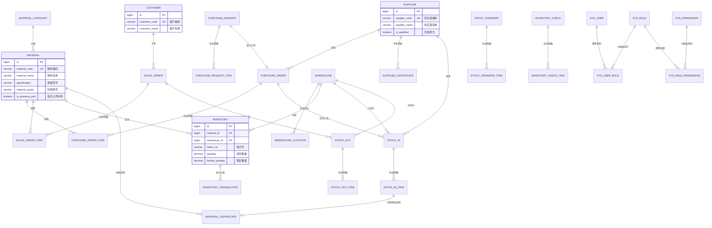
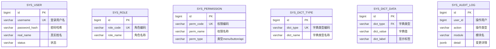
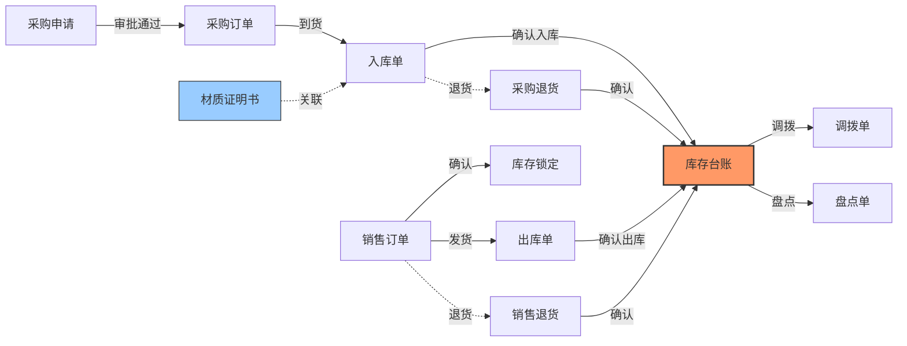
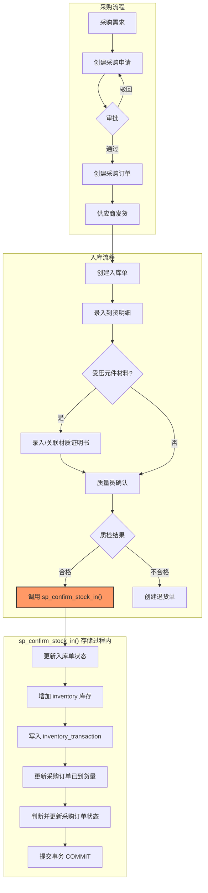
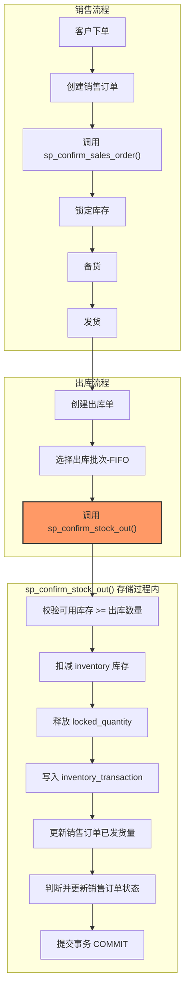
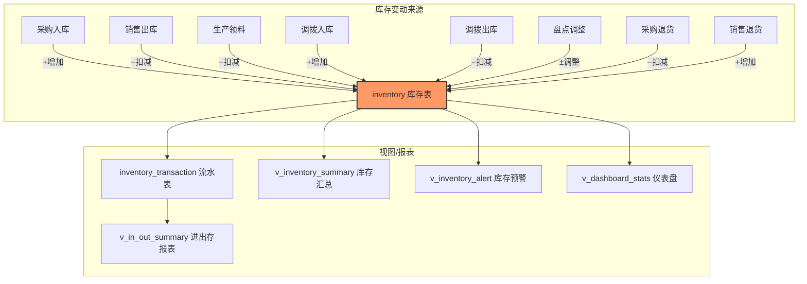

# 特维存（TeWeiCun）— 数据库设计文档

> **文档版本**：v1.0  
> **创建日期**：2026-04-11  
> **最后更新**：2026-04-11  
> **数据库**：PostgreSQL 16+  
> **设计原则**：DB-First，业务逻辑下沉数据库，充分利用 PG 可编程能力

---

## 目录

- [1. 设计理念](#1-设计理念)
- [2. 概念模型](#2-概念模型)
- [3. 数据流图](#3-数据流图)
- [4. 物理模型规范](#4-物理模型规范)
- [5. 数据库可编程对象设计](#5-数据库可编程对象设计)
- [6. SQL 脚本目录结构](#6-sql-脚本目录结构)
- [7. 视图设计](#7-视图设计)
- [8. 函数与存储过程设计](#8-函数与存储过程设计)
- [9. 触发器设计](#9-触发器设计)
- [10. 索引策略](#10-索引策略)
- [11. 数据库维护](#11-数据库维护)

---

## 1. 设计理念

### 1.1 DB-First 架构

本项目采用 **数据库优先（DB-First）** 的架构策略：

| 层级 | 职责 | 实现方式 |
|------|------|---------|
| **数据库层** | 数据完整性、事务控制、业务流程、报表计算 | 存储过程/函数/触发器/视图 |
| **后端应用层** | API 路由、参数校验、认证鉴权、调用数据库 | Go + 手写 SQL |
| **前端层** | 用户界面、交互逻辑 | SvelteKit + Tailwind/DaisyUI |

### 1.2 核心原则

```
┌─────────────────────────────────────────────────────────────┐
│                     前端 (SvelteKit)                         │
│              负责：UI 渲染、用户交互                          │
├─────────────────────────────────────────────────────────────┤
│                    后端 (Go/Gin)                             │
│   负责：API 路由、参数校验、JWT 认证、RBAC 鉴权               │
│   数据库交互：全部使用手写 SQL（不用 ORM）                     │
│   调用存储过程执行业务逻辑                                    │
├─────────────────────────────────────────────────────────────┤
│                  PostgreSQL 数据库                            │
│   负责：                                                     │
│   ├── 存储过程：单据审批、入库确认、出库确认、状态流转          │
│   ├── 函数：单据编号生成、库存计算、追溯查询                   │
│   ├── 触发器：审计日志、时间戳自动更新、数据校验               │
│   ├── 视图：报表数据、仪表盘汇总、库存预警                    │
│   ├── 约束：数据完整性、CHECK 约束                            │
│   └── 事务：所有多表操作在存储过程内完成事务控制                │
└─────────────────────────────────────────────────────────────┘
```

**什么放数据库**：
- ✅ 多表事务操作（入库/出库/调拨/盘点确认）
- ✅ 单据状态机流转和校验
- ✅ 单据编号自动生成
- ✅ 审计日志自动记录
- ✅ 报表统计和汇总计算
- ✅ 库存预警查询
- ✅ 材料追溯查询
- ✅ 数据完整性校验

**什么放应用层**：
- ✅ HTTP API 路由和参数绑定
- ✅ JWT 认证和 RBAC 权限控制
- ✅ 文件上传/下载
- ✅ Redis 缓存管理
- ✅ 简单的 CRUD 查询（SELECT/INSERT/UPDATE/DELETE）
- ✅ 密码加密（bcrypt）

---

## 2. 概念模型

### 2.1 核心业务实体关系（ER 图）



### 2.2 系统实体关系图



### 2.3 单据间关系图



---

## 3. 数据流图

### 3.1 采购入库数据流



### 3.2 销售出库数据流



### 3.3 库存管理数据流



---

## 4. 物理模型规范

### 4.1 命名规范

| 对象 | 规范 | 示例 |
|------|------|------|
| schema | 默认 `public` | — |
| 表 | 小写下划线，单数，业务表无前缀，系统表 `sys_` 前缀 | `material`, `sys_user` |
| 列 | 小写下划线 | `material_code`, `created_at` |
| 主键 | `id`（BIGSERIAL） | — |
| 外键列 | `关联表名_id` | `supplier_id`, `material_id` |
| 普通索引 | `idx_表名_字段名` | `idx_material_code` |
| 唯一索引 | `uk_表名_字段名` | `uk_material_code` |
| 联合索引 | `idx_表名_字段1_字段2` | `idx_inventory_material_warehouse` |
| CHECK 约束 | `chk_表名_描述` | `chk_inventory_qty` |
| 存储过程 | `sp_动作_对象` | `sp_confirm_stock_in` |
| 函数 | `fn_动作_对象` | `fn_generate_serial_no` |
| 触发器 | `trg_表名_动作` | `trg_material_audit` |
| 触发器函数 | `trf_表名_动作` | `trf_material_audit` |
| 视图 | `v_描述` | `v_inventory_summary` |
| 序列 | 表名_id_seq（默认 BIGSERIAL 自动创建） | `material_id_seq` |

### 4.2 字段类型规范

| 场景 | 类型 | 说明 |
|------|------|------|
| 主键 | `BIGSERIAL` | 自增长整型 |
| 编码/编号 | `VARCHAR(n)` | 根据业务确定长度 |
| 名称/描述 | `VARCHAR(n)` | 短文本用 VARCHAR |
| 备注/长文本 | `TEXT` | 无长度限制 |
| 金额 | `NUMERIC(18,2)` | 精确数值，2位小数 |
| 数量 | `NUMERIC(18,3)` | 精确数值，3位小数 |
| 换算系数 | `NUMERIC(18,6)` | 精确数值，6位小数 |
| 布尔 | `BOOLEAN` | `DEFAULT FALSE` |
| 日期 | `DATE` | 不含时区 |
| 时间戳 | `TIMESTAMPTZ` | 含时区，`DEFAULT NOW()` |
| 状态/枚举 | `VARCHAR(20)` | 不使用 PG ENUM 类型 |
| JSON 数据 | `JSONB` | 化学成分、力学性能等 |

### 4.3 通用字段

**每个业务表必须包含以下审计字段**：

```sql
created_by  BIGINT,                                -- 创建人ID
created_at  TIMESTAMPTZ   NOT NULL DEFAULT NOW(),  -- 创建时间
updated_by  BIGINT,                                -- 更新人ID
updated_at  TIMESTAMPTZ   NOT NULL DEFAULT NOW(),  -- 更新时间
deleted_at  TIMESTAMPTZ                            -- 删除时间(软删除)
```

**所有表和列必须带 COMMENT 注释**：

```sql
-- 使用 COMMENT ON 为所有对象添加中文注释
COMMENT ON TABLE material IS '物料主数据表';
COMMENT ON COLUMN material.id IS '物料ID，主键';
COMMENT ON COLUMN material.material_code IS '物料编码，全局唯一';
COMMENT ON COLUMN material.material_name IS '物料名称';
-- ...为每一列都添加注释
```

### 4.4 约束规范

```sql
-- ✅ 使用 CHECK 约束确保数据完整性
CONSTRAINT chk_inventory_qty CHECK (quantity >= 0),
CONSTRAINT chk_inventory_locked CHECK (locked_quantity >= 0 AND locked_quantity <= quantity),
CONSTRAINT chk_po_item_qty CHECK (quantity > 0),
CONSTRAINT chk_po_item_amount CHECK (amount >= 0),

-- ✅ 使用部分唯一索引（排除软删除记录）
CREATE UNIQUE INDEX uk_material_code ON material(material_code) WHERE deleted_at IS NULL;

-- ❌ 不使用数据库级外键约束（避免级联问题，由应用/存储过程控制）
-- ❌ 不使用 PG 的 ENUM 类型（扩展性差）
```

### 4.5 可空字段与应用层映射约定

```sql
-- 列表/详情查询中，对可空字符串展示字段优先收口：
SELECT
    m.id,
    m.material_code,
    COALESCE(m.material_grade, '') AS material_grade,
    COALESCE(m.standard_no, '') AS standard_no
FROM material m
WHERE m.deleted_at IS NULL;
```

- 对于语义上允许“有或无”的字段，应用层可使用 `*string` / `sql.NullString` / `pgtype.Text`。
- 新增可空列、增加 LEFT JOIN 后，必须回归检查 Go 层 `Scan` 类型，避免 `cannot scan NULL into *string`。
- 上述策略由 SQL 脚本评审与接口联调共同兜底。

---

## 5. 数据库可编程对象设计

### 5.1 对象总览

| 类型 | 数量 | 用途 |
|------|------|------|
| **存储过程** | ~15 个 | 核心业务流程（入库/出库/审批/盘点/调拨等） |
| **函数** | ~10 个 | 编号生成、库存查询、追溯查询等 |
| **触发器** | ~8 个 | 审计日志、时间戳更新、数据校验 |
| **视图** | ~15 个 | 报表汇总、仪表盘、库存预警 |

### 5.2 存储过程清单

| 存储过程名 | 说明 | 涉及表 |
|-----------|------|--------|
| `sp_confirm_stock_in` | 确认入库（核心） | stock_in, stock_in_item, inventory, inventory_transaction, purchase_order, purchase_order_item |
| `sp_confirm_stock_out` | 确认出库 | stock_out, stock_out_item, inventory, inventory_transaction |
| `sp_confirm_transfer_out` | 确认调拨出库 | stock_transfer, inventory, inventory_transaction |
| `sp_confirm_transfer_in` | 确认调拨入库 | stock_transfer, inventory, inventory_transaction |
| `sp_confirm_inventory_check` | 确认盘点（调账）| inventory_check, inventory_check_item, inventory, inventory_transaction |
| `sp_approve_purchase_request` | 审批采购申请 | purchase_request |
| `sp_confirm_purchase_order` | 确认采购订单 | purchase_order |
| `sp_confirm_sales_order` | 确认销售订单（锁定库存）| sales_order, sales_order_item, inventory |
| `sp_cancel_sales_order` | 取消销售订单（释放库存）| sales_order, sales_order_item, inventory |
| `sp_ship_sales_order` | 销售发货（创建出库单）| sales_order, stock_out, stock_out_item |
| `sp_confirm_purchase_return` | 确认采购退货 | return_order, return_order_item, inventory, inventory_transaction |
| `sp_confirm_sales_return` | 确认销售退货入库 | return_order, return_order_item, inventory, inventory_transaction |
| `sp_check_stock_alerts` | 检查库存预警并生成通知 | inventory, material, sys_notification, sys_dict_data |
| `sp_write_audit_log` | 写入审计日志 | sys_audit_log |

### 5.3 函数清单

| 函数名 | 返回值 | 说明 |
|-------|-------|------|
| `fn_generate_serial_no(prefix, date)` | VARCHAR | 生成单据编号，如 PO20260411001 |
| `fn_get_available_stock(material_id, warehouse_id)` | NUMERIC | 获取可用库存 = quantity - locked_quantity |
| `fn_get_material_stock_summary(material_id)` | TABLE | 按仓库/批次汇总某物料的库存 |
| `fn_trace_backward(product_no)` | TABLE | 反向追溯：产品编号 → 材料来源 |
| `fn_get_category_tree()` | JSONB | 返回物料分类树形 JSON |
| `fn_calc_inventory_turnover(start_date, end_date)` | TABLE | 计算库存周转率 |
| `fn_check_supplier_qualified(supplier_id)` | BOOLEAN | 检查供应商是否为有效合格供方 |
| `fn_get_user_permissions(user_id)` | TABLE | 获取用户的所有权限编码 |
| `fn_soft_delete_check(table_name, record_id)` | BOOLEAN | 通用软删除前检查是否有依赖 |

---

## 6. SQL 脚本目录结构

```
sql/
├── migrations/                    # 数据库迁移脚本（版本化，按顺序执行）
│   ├── V001__init_schema.sql          # 建表 DDL + COMMENT + 索引 + 约束
│   ├── V002__init_seed_data.sql       # 初始数据（管理员、角色、权限、字典）
│   ├── V003__create_functions.sql     # 创建所有函数
│   ├── V004__create_procedures.sql    # 创建所有存储过程
│   ├── V005__create_triggers.sql      # 创建所有触发器
│   ├── V006__create_views.sql         # 创建所有视图
│   └── V007__init_material_categories.sql  # 初始化物料分类
│
├── functions/                     # 函数定义（独立维护，方便修改重建）
│   ├── fn_generate_serial_no.sql
│   ├── fn_get_available_stock.sql
│   ├── fn_get_material_stock_summary.sql
│   ├── fn_trace_backward.sql
│   ├── fn_get_category_tree.sql
│   ├── fn_calc_inventory_turnover.sql
│   ├── fn_check_supplier_qualified.sql
│   ├── fn_get_user_permissions.sql
│   └── fn_soft_delete_check.sql
│
├── procedures/                    # 存储过程定义
│   ├── sp_confirm_stock_in.sql
│   ├── sp_confirm_stock_out.sql
│   ├── sp_confirm_transfer_out.sql
│   ├── sp_confirm_transfer_in.sql
│   ├── sp_confirm_inventory_check.sql
│   ├── sp_approve_purchase_request.sql
│   ├── sp_confirm_purchase_order.sql
│   ├── sp_confirm_sales_order.sql
│   ├── sp_cancel_sales_order.sql
│   ├── sp_ship_sales_order.sql
│   ├── sp_confirm_purchase_return.sql
│   ├── sp_confirm_sales_return.sql
│   ├── sp_check_stock_alerts.sql
│   └── sp_write_audit_log.sql
│
├── triggers/                      # 触发器定义
│   ├── trg_auto_update_timestamp.sql      # 通用 updated_at 自动更新
│   ├── trg_material_audit.sql             # 物料变更审计
│   ├── trg_inventory_check_constraint.sql # 库存非负约束增强
│   ├── trg_purchase_order_amount.sql      # 采购订单金额自动汇总
│   ├── trg_sales_order_amount.sql         # 销售订单金额自动汇总
│   └── trg_stock_in_batch_no.sql          # 批次号自动生成
│
├── views/                         # 视图定义
│   ├── v_inventory_summary.sql        # 库存汇总视图
│   ├── v_inventory_detail.sql         # 库存明细视图（关联物料/仓库名称）
│   ├── v_inventory_alert.sql          # 库存预警视图
│   ├── v_in_out_summary.sql           # 进出存报表视图
│   ├── v_purchase_order_tracking.sql  # 采购订单跟踪视图
│   ├── v_sales_order_tracking.sql     # 销售订单跟踪视图
│   ├── v_purchase_summary.sql         # 采购汇总视图
│   ├── v_sales_summary.sql            # 销售汇总视图
│   ├── v_supplier_stats.sql           # 供应商统计视图
│   ├── v_customer_stats.sql           # 客户统计视图
│   ├── v_dashboard_stats.sql          # 仪表盘统计视图
│   ├── v_dashboard_trend.sql          # 出入库趋势视图
│   ├── v_stock_top_value.sql          # 库存金额 TOP 视图
│   ├── v_material_trace_forward.sql   # 正向追溯视图
│   └── v_material_trace_backward.sql  # 反向追溯视图
│
├── seed/                          # 初始数据
│   ├── 01_sys_user_role.sql           # 初始用户和角色
│   ├── 02_sys_permissions.sql         # 权限菜单数据
│   ├── 03_sys_dict.sql                # 数据字典
│   └── 04_material_categories.sql     # 物料分类
│
├── changes/                       # 迭代变更脚本（按版本号命名）
│   ├── v1.1.0_add_contract_fields.sql
│   └── v1.2.0_add_finance_tables.sql
│
└── tools/                         # 工具脚本
    ├── backup.sh                      # 数据库备份
    ├── restore.sh                     # 数据库恢复
    ├── rebuild_functions.sql          # 重建所有函数（开发用）
    ├── rebuild_procedures.sql         # 重建所有存储过程
    ├── rebuild_views.sql              # 重建所有视图
    └── check_comments.sql            # 检查缺少注释的对象
```

---

## 7. 视图设计

### 7.1 库存汇总视图

```sql
-- v_inventory_summary: 按物料汇总库存
CREATE OR REPLACE VIEW v_inventory_summary AS
SELECT
    m.id AS material_id,
    m.material_code,
    m.material_name,
    m.specification,
    m.material_grade,
    m.unit,
    m.is_pressure_part,
    mc.category_name,
    m.safety_stock,
    m.max_stock,
    COALESCE(SUM(i.quantity), 0) AS total_quantity,
    COALESCE(SUM(i.locked_quantity), 0) AS total_locked,
    COALESCE(SUM(i.quantity - i.locked_quantity), 0) AS available_quantity,
    COALESCE(SUM(i.quantity * i.unit_cost), 0) AS total_value,
    COUNT(DISTINCT i.warehouse_id) AS warehouse_count,
    COUNT(DISTINCT i.batch_no) AS batch_count,
    -- 预警标记
    CASE 
        WHEN m.safety_stock > 0 AND COALESCE(SUM(i.quantity), 0) <= m.safety_stock THEN '库存不足'
        WHEN m.max_stock > 0 AND COALESCE(SUM(i.quantity), 0) >= m.max_stock THEN '库存积压'
        ELSE '正常'
    END AS stock_status
FROM material m
LEFT JOIN material_category mc ON mc.id = m.category_id
LEFT JOIN inventory i ON i.material_id = m.id
WHERE m.deleted_at IS NULL
  AND m.status = 'enabled'
GROUP BY m.id, m.material_code, m.material_name, m.specification,
         m.material_grade, m.unit, m.is_pressure_part, mc.category_name,
         m.safety_stock, m.max_stock;

COMMENT ON VIEW v_inventory_summary IS '库存汇总视图：按物料汇总所有仓库库存，含预警状态';
```

### 7.2 库存预警视图

```sql
-- v_inventory_alert: 库存预警
CREATE OR REPLACE VIEW v_inventory_alert AS
-- 库存不足
SELECT 
    'low_stock' AS alert_type,
    '库存不足' AS alert_name,
    m.id AS material_id,
    m.material_code,
    m.material_name,
    m.specification,
    COALESCE(s.total_qty, 0) AS current_stock,
    m.safety_stock AS threshold,
    NULL::DATE AS expire_date,
    NULL::INTEGER AS overdue_days
FROM material m
LEFT JOIN (
    SELECT material_id, SUM(quantity) AS total_qty
    FROM inventory
    GROUP BY material_id
) s ON s.material_id = m.id
WHERE m.deleted_at IS NULL
  AND m.status = 'enabled'
  AND m.safety_stock > 0
  AND COALESCE(s.total_qty, 0) <= m.safety_stock

UNION ALL

-- 库存积压
SELECT 
    'over_stock', '库存积压',
    m.id, m.material_code, m.material_name, m.specification,
    COALESCE(s.total_qty, 0), m.max_stock, NULL, NULL
FROM material m
LEFT JOIN (
    SELECT material_id, SUM(quantity) AS total_qty
    FROM inventory
    GROUP BY material_id
) s ON s.material_id = m.id
WHERE m.deleted_at IS NULL
  AND m.status = 'enabled'
  AND m.max_stock > 0
  AND COALESCE(s.total_qty, 0) >= m.max_stock

UNION ALL

-- 效期预警（30天内到期）
SELECT 
    'expiring', '即将过期',
    m.id, m.material_code, m.material_name, m.specification,
    i.quantity, 0, i.expire_date,
    (i.expire_date - CURRENT_DATE)
FROM inventory i
JOIN material m ON m.id = i.material_id
WHERE i.expire_date IS NOT NULL
  AND i.expire_date <= CURRENT_DATE + INTERVAL '30 days'
  AND i.quantity > 0

UNION ALL

-- 超期库存（入库超过180天）
SELECT 
    'overdue', '超期库存',
    m.id, m.material_code, m.material_name, m.specification,
    i.quantity, 0, NULL,
    (CURRENT_DATE - i.stock_in_date)
FROM inventory i
JOIN material m ON m.id = i.material_id
WHERE i.stock_in_date < CURRENT_DATE - INTERVAL '180 days'
  AND i.quantity > 0;

COMMENT ON VIEW v_inventory_alert IS '库存预警视图：包含低库存、积压、过期、超期四类预警';
```

### 7.3 仪表盘统计视图

```sql
-- v_dashboard_stats: 首页仪表盘数据
CREATE OR REPLACE VIEW v_dashboard_stats AS
SELECT
    -- 今日入库单数
    (SELECT COUNT(*) FROM stock_in WHERE stock_in_date = CURRENT_DATE AND deleted_at IS NULL) AS today_stock_in_count,
    -- 今日出库单数
    (SELECT COUNT(*) FROM stock_out WHERE stock_out_date = CURRENT_DATE AND deleted_at IS NULL) AS today_stock_out_count,
    -- 今日新增采购订单
    (SELECT COUNT(*) FROM purchase_order WHERE order_date = CURRENT_DATE AND deleted_at IS NULL) AS today_po_count,
    -- 今日新增销售订单
    (SELECT COUNT(*) FROM sales_order WHERE order_date = CURRENT_DATE AND deleted_at IS NULL) AS today_so_count,
    -- 库存预警数
    (SELECT COUNT(*) FROM v_inventory_alert WHERE alert_type = 'low_stock') AS low_stock_count,
    (SELECT COUNT(*) FROM v_inventory_alert WHERE alert_type = 'overdue') AS overdue_stock_count,
    -- 待办事项
    (SELECT COUNT(*) FROM purchase_request WHERE approval_status = 'pending' AND deleted_at IS NULL) AS pending_approval_count,
    (SELECT COUNT(*) FROM purchase_order WHERE order_status = 'ordered' AND deleted_at IS NULL) AS pending_stock_in_count,
    (SELECT COUNT(*) FROM sales_order WHERE order_status IN ('confirmed', 'preparing') AND deleted_at IS NULL) AS pending_ship_count;

COMMENT ON VIEW v_dashboard_stats IS '仪表盘统计视图：今日概览、预警汇总、待办事项';
```

### 7.4 进出存报表视图

```sql
-- v_in_out_summary: 进出存报表（需传参数使用函数更合适，此为基础视图）
CREATE OR REPLACE VIEW v_in_out_summary AS
SELECT
    it.material_id,
    m.material_code,
    m.material_name,
    m.specification,
    m.unit,
    it.warehouse_id,
    w.warehouse_name,
    DATE_TRUNC('day', it.created_at)::DATE AS trans_date,
    SUM(CASE WHEN it.trans_type = 'in' THEN it.quantity ELSE 0 END) AS in_quantity,
    SUM(CASE WHEN it.trans_type = 'out' THEN ABS(it.quantity) ELSE 0 END) AS out_quantity,
    SUM(CASE WHEN it.trans_type = 'adjust' THEN it.quantity ELSE 0 END) AS adjust_quantity
FROM inventory_transaction it
JOIN material m ON m.id = it.material_id
JOIN warehouse w ON w.id = it.warehouse_id
GROUP BY it.material_id, m.material_code, m.material_name, m.specification, m.unit,
         it.warehouse_id, w.warehouse_name, DATE_TRUNC('day', it.created_at)::DATE;

COMMENT ON VIEW v_in_out_summary IS '进出存报表基础视图：按物料+仓库+日期汇总进出数量';
```

---

## 8. 函数与存储过程设计

### 8.1 单据编号生成函数

```sql
-- fn_generate_serial_no: 生成单据带日期的流水号
-- 使用 advisory lock 保证并发安全
CREATE OR REPLACE FUNCTION fn_generate_serial_no(
    p_prefix VARCHAR,
    p_date DATE DEFAULT CURRENT_DATE
) RETURNS VARCHAR
LANGUAGE plpgsql
AS $$
DECLARE
    v_date_str VARCHAR(8);
    v_seq INT;
    v_result VARCHAR;
    v_lock_key BIGINT;
BEGIN
    v_date_str := TO_CHAR(p_date, 'YYYYMMDD');
    
    -- 使用 advisory lock 替代行锁，更轻量
    v_lock_key := hashtext(p_prefix || v_date_str);
    PERFORM pg_advisory_xact_lock(v_lock_key);
    
    -- UPSERT 序号
    INSERT INTO sys_serial_number (prefix, date_str, current_seq)
    VALUES (p_prefix, v_date_str, 1)
    ON CONFLICT (prefix, date_str) 
    DO UPDATE SET current_seq = sys_serial_number.current_seq + 1
    RETURNING current_seq INTO v_seq;
    
    v_result := p_prefix || v_date_str || LPAD(v_seq::TEXT, 3, '0');
    RETURN v_result;
END;
$$;

COMMENT ON FUNCTION fn_generate_serial_no IS '生成单据编号，格式：前缀+YYYYMMDD+3位序号，并发安全';
```

### 8.2 入库确认存储过程（核心）

```sql
-- sp_confirm_stock_in: 确认入库（完整事务）
CREATE OR REPLACE PROCEDURE sp_confirm_stock_in(
    p_stock_in_id BIGINT,
    p_operator_id BIGINT
)
LANGUAGE plpgsql
AS $$
DECLARE
    v_stock_in RECORD;
    v_item RECORD;
    v_po_id BIGINT;
    v_po_all_received BOOLEAN;
    v_inv_id BIGINT;
BEGIN
    -- 1. 查询并锁定入库单
    SELECT si.*, si.purchase_order_id
    INTO v_stock_in
    FROM stock_in si
    WHERE si.id = p_stock_in_id
      AND si.deleted_at IS NULL
    FOR UPDATE;
    
    IF v_stock_in IS NULL THEN
        RAISE EXCEPTION '入库单不存在 [id=%]', p_stock_in_id;
    END IF;
    
    IF v_stock_in.stock_in_status != 'pending' THEN
        RAISE EXCEPTION '入库单状态不允许确认 [当前状态=%]', v_stock_in.stock_in_status;
    END IF;
    
    -- 2. 更新入库单状态
    UPDATE stock_in 
    SET stock_in_status = 'passed', updated_by = p_operator_id, updated_at = NOW()
    WHERE id = p_stock_in_id;
    
    -- 3. 逐行处理入库明细
    FOR v_item IN 
        SELECT sii.*, m.is_pressure_part
        FROM stock_in_item sii
        JOIN material m ON m.id = sii.material_id
        WHERE sii.stock_in_id = p_stock_in_id
    LOOP
        -- 3.1 受压元件材料必须关联材质证明
        IF v_item.is_pressure_part AND v_item.cert_id IS NULL THEN
            RAISE EXCEPTION '受压元件材料必须关联材质证明书 [物料ID=%]', v_item.material_id;
        END IF;
        
        -- 3.2 UPSERT 库存记录
        INSERT INTO inventory (
            material_id, warehouse_id, batch_no, location_id,
            quantity, locked_quantity, unit, stock_in_date, unit_cost
        ) VALUES (
            v_item.material_id, v_stock_in.warehouse_id, v_item.batch_no,
            v_item.location_id,
            v_item.accepted_quantity, 0, v_item.unit,
            v_stock_in.stock_in_date, 0
        )
        ON CONFLICT (material_id, warehouse_id, batch_no, (COALESCE(location_id, 0)))
        DO UPDATE SET 
            quantity = inventory.quantity + v_item.accepted_quantity,
            updated_at = NOW()
        RETURNING id INTO v_inv_id;
        
        -- 3.3 写入库存流水
        INSERT INTO inventory_transaction (
            material_id, warehouse_id, batch_no, trans_type,
            quantity, balance, ref_doc_type, ref_doc_no, ref_doc_id,
            operator_id
        ) VALUES (
            v_item.material_id, v_stock_in.warehouse_id, v_item.batch_no,
            'in', v_item.accepted_quantity,
            (SELECT quantity FROM inventory WHERE id = v_inv_id),
            'stock_in', v_stock_in.stock_in_no, p_stock_in_id,
            p_operator_id
        );
        
        -- 3.4 更新采购订单明细的已到货数量
        IF v_stock_in.purchase_order_id IS NOT NULL THEN
            UPDATE purchase_order_item
            SET received_quantity = received_quantity + v_item.accepted_quantity,
                updated_at = NOW()
            WHERE order_id = v_stock_in.purchase_order_id
              AND material_id = v_item.material_id;
        END IF;
    END LOOP;
    
    -- 4. 更新采购订单状态
    IF v_stock_in.purchase_order_id IS NOT NULL THEN
        v_po_id := v_stock_in.purchase_order_id;
        
        -- 判断是否全部到货
        SELECT NOT EXISTS (
            SELECT 1 FROM purchase_order_item
            WHERE order_id = v_po_id
              AND received_quantity < quantity
        ) INTO v_po_all_received;
        
        IF v_po_all_received THEN
            UPDATE purchase_order 
            SET order_status = 'full_received', updated_by = p_operator_id, updated_at = NOW()
            WHERE id = v_po_id;
        ELSE
            UPDATE purchase_order 
            SET order_status = 'partial_received', updated_by = p_operator_id, updated_at = NOW()
            WHERE id = v_po_id AND order_status = 'ordered';
        END IF;
    END IF;
    
    -- 5. 写审计日志
    INSERT INTO sys_audit_log (user_id, username, action, module, target_type, target_id, detail)
    SELECT p_operator_id, u.username, 'CONFIRM', 'stock_in', 'stock_in', p_stock_in_id,
           jsonb_build_object('stock_in_no', v_stock_in.stock_in_no)
    FROM sys_user u WHERE u.id = p_operator_id;
    
END;
$$;

COMMENT ON PROCEDURE sp_confirm_stock_in IS '确认入库：更新入库单状态、增加库存、写流水、更新采购订单，全部在同一事务中';
```

### 8.3 出库确认存储过程

```sql
-- sp_confirm_stock_out: 确认出库
CREATE OR REPLACE PROCEDURE sp_confirm_stock_out(
    p_stock_out_id BIGINT,
    p_operator_id BIGINT
)
LANGUAGE plpgsql
AS $$
DECLARE
    v_stock_out RECORD;
    v_item RECORD;
    v_current_qty NUMERIC(18,3);
BEGIN
    -- 1. 查询并锁定出库单
    SELECT * INTO v_stock_out
    FROM stock_out
    WHERE id = p_stock_out_id AND deleted_at IS NULL
    FOR UPDATE;
    
    IF v_stock_out IS NULL THEN
        RAISE EXCEPTION '出库单不存在 [id=%]', p_stock_out_id;
    END IF;
    
    -- 2. 逐行处理出库明细
    FOR v_item IN 
        SELECT soi.*, m.is_pressure_part
        FROM stock_out_item soi
        JOIN material m ON m.id = soi.material_id
        WHERE soi.stock_out_id = p_stock_out_id
    LOOP
        -- 2.1 受压元件出库必须有用途说明
        IF v_item.is_pressure_part AND (v_item.usage_desc IS NULL OR v_item.usage_desc = '') THEN
            RAISE EXCEPTION '受压元件材料出库必须填写用途说明 [物料ID=%]', v_item.material_id;
        END IF;
        
        -- 2.2 扣减库存（带行锁）
        UPDATE inventory
        SET quantity = quantity - v_item.quantity,
            updated_at = NOW()
        WHERE material_id = v_item.material_id
          AND warehouse_id = v_stock_out.warehouse_id
          AND batch_no = v_item.batch_no
          AND quantity >= v_item.quantity  -- 确保库存充足
        RETURNING quantity INTO v_current_qty;
        
        IF NOT FOUND THEN
            RAISE EXCEPTION '库存不足 [物料ID=%, 批次=%, 请求数量=%]', 
                v_item.material_id, v_item.batch_no, v_item.quantity;
        END IF;
        
        -- 2.3 写入库存流水
        INSERT INTO inventory_transaction (
            material_id, warehouse_id, batch_no, trans_type,
            quantity, balance, ref_doc_type, ref_doc_no, ref_doc_id,
            operator_id
        ) VALUES (
            v_item.material_id, v_stock_out.warehouse_id, v_item.batch_no,
            'out', -v_item.quantity, v_current_qty,
            'stock_out', v_stock_out.stock_out_no, p_stock_out_id,
            p_operator_id
        );
    END LOOP;
    
    -- 3. 写审计日志
    INSERT INTO sys_audit_log (user_id, username, action, module, target_type, target_id, detail)
    SELECT p_operator_id, u.username, 'CONFIRM', 'stock_out', 'stock_out', p_stock_out_id,
           jsonb_build_object('stock_out_no', v_stock_out.stock_out_no, 'out_type', v_stock_out.out_type)
    FROM sys_user u WHERE u.id = p_operator_id;
    
END;
$$;

COMMENT ON PROCEDURE sp_confirm_stock_out IS '确认出库：校验库存、扣减库存、写流水，全部在同一事务中';
```

---

## 9. 触发器设计

### 9.1 通用时间戳触发器

```sql
-- 通用 updated_at 自动更新触发器函数
CREATE OR REPLACE FUNCTION trf_auto_update_timestamp()
RETURNS TRIGGER
LANGUAGE plpgsql
AS $$
BEGIN
    NEW.updated_at = NOW();
    RETURN NEW;
END;
$$;

COMMENT ON FUNCTION trf_auto_update_timestamp IS '通用触发器函数：自动更新 updated_at 为当前时间';

-- 为所有需要的表创建触发器（示例）
-- material, supplier, customer, warehouse, purchase_order, sales_order 等
CREATE TRIGGER trg_material_update_timestamp
    BEFORE UPDATE ON material
    FOR EACH ROW
    EXECUTE FUNCTION trf_auto_update_timestamp();

CREATE TRIGGER trg_supplier_update_timestamp
    BEFORE UPDATE ON supplier
    FOR EACH ROW
    EXECUTE FUNCTION trf_auto_update_timestamp();

-- ...其他表类似
```

### 9.2 采购订单金额自动汇总触发器

```sql
-- 采购订单明细变更时自动更新订单总金额
CREATE OR REPLACE FUNCTION trf_purchase_order_amount()
RETURNS TRIGGER
LANGUAGE plpgsql
AS $$
DECLARE
    v_order_id BIGINT;
BEGIN
    v_order_id := COALESCE(NEW.order_id, OLD.order_id);
    
    UPDATE purchase_order
    SET total_amount = (
        SELECT COALESCE(SUM(amount), 0)
        FROM purchase_order_item
        WHERE order_id = v_order_id
    )
    WHERE id = v_order_id;
    
    RETURN COALESCE(NEW, OLD);
END;
$$;

CREATE TRIGGER trg_poi_amount_sync
    AFTER INSERT OR UPDATE OF amount OR DELETE ON purchase_order_item
    FOR EACH ROW
    EXECUTE FUNCTION trf_purchase_order_amount();

COMMENT ON FUNCTION trf_purchase_order_amount IS '采购订单明细变更时自动汇总更新订单总金额';
```

### 9.3 库存非负约束触发器

```sql
-- 增强的库存非负约束（CHECK 约束的补充），提供更友好的错误信息
CREATE OR REPLACE FUNCTION trf_inventory_check_constraint()
RETURNS TRIGGER
LANGUAGE plpgsql
AS $$
DECLARE
    v_material_name VARCHAR;
BEGIN
    IF NEW.quantity < 0 THEN
        SELECT material_name INTO v_material_name FROM material WHERE id = NEW.material_id;
        RAISE EXCEPTION '库存不能为负数 [物料: %, 批次: %, 当前数量: %]',
            v_material_name, NEW.batch_no, NEW.quantity;
    END IF;
    
    IF NEW.locked_quantity > NEW.quantity THEN
        SELECT material_name INTO v_material_name FROM material WHERE id = NEW.material_id;
        RAISE EXCEPTION '锁定数量不能超过库存数量 [物料: %, 库存: %, 锁定: %]',
            v_material_name, NEW.quantity, NEW.locked_quantity;
    END IF;
    
    RETURN NEW;
END;
$$;

CREATE TRIGGER trg_inventory_check
    BEFORE INSERT OR UPDATE ON inventory
    FOR EACH ROW
    EXECUTE FUNCTION trf_inventory_check_constraint();

COMMENT ON FUNCTION trf_inventory_check_constraint IS '库存表约束触发器：确保库存非负且锁定量不超过库存';
```

---

## 10. 索引策略

### 10.1 索引类型使用原则

| 索引类型 | 使用场景 | 示例 |
|---------|---------|------|
| B-Tree（默认）| 等值查询、范围查询、排序 | 编码、日期、状态 |
| 部分索引 | 排除软删除记录 | `WHERE deleted_at IS NULL` |
| GIN | JSONB 字段查询 | 材质证明的化学成分 |
| 联合索引 | 多列组合查询 | 库存表的 (material_id, warehouse_id) |
| 唯一索引 | 业务唯一约束 | 物料编码、单据编号 |

### 10.2 关键索引清单

```sql
-- 高频查询优化索引
-- inventory 表（查询最频繁的表）
CREATE INDEX idx_inventory_material_wh ON inventory(material_id, warehouse_id);
CREATE INDEX idx_inventory_batch ON inventory(batch_no);
CREATE INDEX idx_inventory_expire ON inventory(expire_date) WHERE expire_date IS NOT NULL;
CREATE INDEX idx_inventory_stock_date ON inventory(stock_in_date);

-- inventory_transaction 表（流水查询）
CREATE INDEX idx_inv_trans_material_date ON inventory_transaction(material_id, created_at);
CREATE INDEX idx_inv_trans_ref ON inventory_transaction(ref_doc_type, ref_doc_no);

-- 单据表的状态+日期联合索引
CREATE INDEX idx_po_status_date ON purchase_order(order_status, order_date) WHERE deleted_at IS NULL;
CREATE INDEX idx_so_status_date ON sales_order(order_status, order_date) WHERE deleted_at IS NULL;

CREATE INDEX idx_soi_usage ON stock_out_item(usage_desc) WHERE usage_desc IS NOT NULL;

-- JSONB 索引（材质证明书化学成分查询）
CREATE INDEX idx_mc_chemical ON material_certificate USING GIN (chemical_composition);
```

---

## 11. 数据库维护

### 11.1 备份策略

```bash
# 每日全量备份（crontab 配置）
# 0 2 * * * /path/to/sql/tools/backup.sh

#!/bin/bash
BACKUP_DIR="/backups/teweicun"
DATE=$(date +%Y%m%d_%H%M%S)
pg_dump -h localhost -U twc -d teweicun -Fc -f "${BACKUP_DIR}/teweicun_${DATE}.dump"
# 保留最近30天
find ${BACKUP_DIR} -name "*.dump" -mtime +30 -delete
```

### 11.2 注释完整性检查

```sql
-- tools/check_comments.sql
-- 检查缺少注释的表
SELECT c.relname AS table_name
FROM pg_class c
JOIN pg_namespace n ON n.oid = c.relnamespace
WHERE c.relkind = 'r'
  AND n.nspname = 'public'
  AND NOT EXISTS (
    SELECT 1 FROM pg_description d 
    WHERE d.objoid = c.oid AND d.objsubid = 0
  )
ORDER BY c.relname;

-- 检查缺少注释的列
SELECT c.relname AS table_name, a.attname AS column_name
FROM pg_class c
JOIN pg_namespace n ON n.oid = c.relnamespace
JOIN pg_attribute a ON a.attrelid = c.oid
WHERE c.relkind = 'r'
  AND n.nspname = 'public'
  AND a.attnum > 0
  AND NOT a.attisdropped
  AND NOT EXISTS (
    SELECT 1 FROM pg_description d 
    WHERE d.objoid = c.oid AND d.objsubid = a.attnum
  )
ORDER BY c.relname, a.attnum;
```

### 11.3 重建可编程对象

```sql
-- tools/rebuild_all.sql
-- 开发环境中重建所有可编程对象，按依赖顺序执行
\echo '=== 重建函数 ==='
\i ../functions/fn_generate_serial_no.sql
\i ../functions/fn_get_available_stock.sql
\i ../functions/fn_get_material_stock_summary.sql
\i ../functions/fn_trace_forward.sql
\i ../functions/fn_trace_backward.sql
\i ../functions/fn_get_category_tree.sql
\i ../functions/fn_calc_inventory_turnover.sql
\i ../functions/fn_check_supplier_qualified.sql
\i ../functions/fn_get_user_permissions.sql

\echo '=== 重建存储过程 ==='
\i ../procedures/sp_confirm_stock_in.sql
\i ../procedures/sp_confirm_stock_out.sql
\i ../procedures/sp_confirm_transfer_out.sql
\i ../procedures/sp_confirm_transfer_in.sql
\i ../procedures/sp_confirm_inventory_check.sql
\i ../procedures/sp_approve_purchase_request.sql
\i ../procedures/sp_confirm_purchase_order.sql
\i ../procedures/sp_confirm_sales_order.sql
\i ../procedures/sp_cancel_sales_order.sql
\i ../procedures/sp_ship_sales_order.sql
\i ../procedures/sp_confirm_purchase_return.sql
\i ../procedures/sp_confirm_sales_return.sql
\i ../procedures/sp_check_stock_alerts.sql
\i ../procedures/sp_write_audit_log.sql

\echo '=== 重建视图 ==='
\i ../views/v_inventory_summary.sql
\i ../views/v_inventory_detail.sql
\i ../views/v_inventory_alert.sql
\i ../views/v_in_out_summary.sql
\i ../views/v_purchase_order_tracking.sql
\i ../views/v_sales_order_tracking.sql
\i ../views/v_purchase_summary.sql
\i ../views/v_sales_summary.sql
\i ../views/v_supplier_stats.sql
\i ../views/v_customer_stats.sql
\i ../views/v_dashboard_stats.sql
\i ../views/v_dashboard_trend.sql
\i ../views/v_stock_top_value.sql

\echo '=== 全部重建完成 ==='
```
